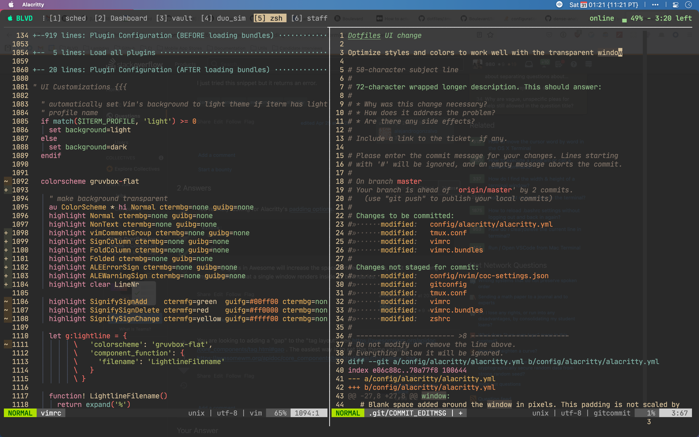

<p align="center">
  
</p>

<p align="center">
  <b>:sparkles: Dorian's Dotfiles :sparkles:</b>
</p>


<br />

### Thanks for dropping by!

This is my personal collection of configuration files.

Here are some details about my setup:

+ **OS**: [Pop!_OS](https://pop.system76.com/)
+ **DE**: [Gnome](https://www.gnome.org)
+ **WM**: [Mutter](https://gitlab.gnome.org/GNOME/mutter)
+ **Shell**: [zsh](https://www.zsh.org/)
+ **Editor**: [Neovim](https://github.com/neovim/neovim/)
+ **Browser**: [Firefox](https://www.mozilla.org/en-US/firefox/new/)
+ **Terminal**: [Alacritty](https://alacritty.org/)
+ **Term Prompt**: [Powerlevel10k](https://github.com/romkatv/powerlevel10k)
+ **Terminal Multiplexer**: [Tmux](https://github.com/tmux/tmux)



Feel free to "steal" anything you want, and if you have a question please open an issue.

--------

# Installation

Easy.. 

```sh
git clone git@github.com:dkarter/dotfiles.git
```

Cd into the dotfiles dir: `cd dotfiles`

```sh
./setup.sh
```

But really you shouldn't use other people's dotfiles.. these are customized to my personal preferences and are subject to change at any time. Instead consider forking https://github.com/nvim-lua/kickstart.nvim which is modern and very minimal and using it as your base to build upon.


--------

# Development

- This repo now uses conventional commits. To install the git hooks simply run `yarn` in the project directory
- To start development use [airmux](https://github.com/dermoumi/airmux) (alias `mux`) inside of the project directory


--------

## FAQ
<details>
<summary>Q: Why are things named without a dot at the beginning?</summary>
A: It makes it easier to include files in this repo if they are not named
exactly how they would be when symlinked over (I symlink the files here to my home
directory).  e.g. if I want to include the global `.gitignore` in this repo it
will override this repo's `.gitignore`.
</details>
